## What I've shipped

- 🚀 **[GradeX](https://github.com/StarkAg/GradeX)** — academic platform serving **9,000+ students** across 430+ sections at SRM. Sub-1s responses (Go + Redis multi-layer cache), Android app on Google Play (**1,650+ installs, 0.00% crash rate**), live at [gradex.bond](https://gradex.bond). Expanded to a second university as [GradeX-BITM](https://github.com/StarkAg/GradeX-BITM).
- 📄 **2 IEEE research papers** — *Intelligent Home Automation with Weather Forecasting* (**published, IEEE ISED 2025**) and *Federated Learning-Based Smart Grid Demand Forecasting* (**under review**).
- 🤖 **Robotics** — 🥈 2nd Place, IoRT Competition @ **Technex'25, IIT (BHU) Varanasi** (Anti-Fall Bot) · 🥉 3rd Place, RoboRacer'24 line-following contest.
- 🛠️ **Real business software** — e-commerce site + auto-updating billing panel used daily by [Shiv Hardware Stores](https://github.com/StarkAg/shivhardware) since 2023.

## Featured projects

| Project | What it is | Stack |
|---|---|---|
| [GradeX](https://github.com/StarkAg/GradeX) | Student portal, 9,000+ users, live at [gradex.bond](https://gradex.bond) | React · Node · Go · Convex · Redis |
| [FedGrid](https://github.com/StarkAg/FedGrid) | Federated-learning smart grid forecasting (IEEE, under review) | Python · TensorFlow · Flower · ESP32 |
| [NexHome](https://github.com/StarkAg/smart-home-automation-esp32) | Predictive IoT home automation (IEEE ISED 2025) | ESP32 · Embedded C · Python |
| [DSA Virtual Lab](https://github.com/StarkAg/DSA_VirtualLab) | Interactive data-structures lab with real code execution | React · Vite · Tailwind |
| [VigilSense](https://github.com/StarkAg/vigil-sense-dashboard) | Autonomous patrol-robot monitoring dashboard with YOLO hazard detection | IoT · Computer Vision · React |
| [Ribil](https://github.com/StarkAg/Ribil) | Karnataka land-records platform covering 24,000+ villages | Next.js · Puppeteer |

<b>More projects</b> — fintech, ML, blockchain, IoT…

- [PersonaX](https://github.com/StarkAg/PersonaX-DeepVision-2025) — customer segmentation with RFM + K-Means
- [Resume Scorer](https://github.com/StarkAg/Resume_Scorer) — TF-IDF + BERT resume–JD matching
- [OCRP](https://github.com/StarkAg/OCRP) — CAPTCHA recognition with TensorFlow/Keras
- [GreenpulseX](https://github.com/StarkAg/GreenpulseX-SIH-2025) — AI crop-yield prediction (SIH 2025)
- [Expenza](https://github.com/StarkAg/expenza) — expense tracker (Next.js 14 + Supabase)
- [ArcStreak](https://github.com/StarkAg/ArcStreak) — React Native habit tracker with cloud sync
- [RealDac](https://github.com/StarkAg/RealDac) — room-synced music (Socket.IO)
- [Stax](https://github.com/StarkAg/stax) — Chrome tab manager for 100+ tab people
- [GDrive 3.0](https://github.com/StarkAg/GDrive3.0-Genesis-1.0) — decentralized storage (IPFS + Ethereum)
- [NFT-Badge](https://github.com/StarkAg/NFT-Badge) — ERC-721 badges on Polygon
- [CertVault](https://github.com/StarkAg/CertVault) — certificate hosting & verification
- [LiftPilot](https://github.com/StarkAg/LiftPilot) — lift dispatch scheduler with weighted cost function
- [aadhaar-secure-qr-verifier](https://github.com/StarkAg/aadhaar-secure-qr-verifier) — offline e-Aadhaar QR signature verification

## Tech I work with

## Contribution snake

